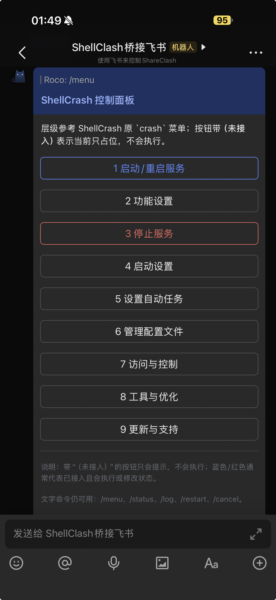

# ShellCrash Feishu Bot

[](https://github.com/Rocoer7/shellcrash-feishu-bot/pkgs/container/shellcrash-feishu-bot)
[](https://github.com/Rocoer7/shellcrash-feishu-bot/actions/workflows/docker-image.yml)
[](#license)
[](https://www.python.org/)

通过飞书机器人控制路由器上的 ShellCrash。支持文字命令和飞书交互卡片，适合部署在 NAS、软路由旁路机或任意 Linux Docker 主机上。

> 镜像地址：`ghcr.io/rocoer7/shellcrash-feishu-bot:latest`

---

## 功能特性

- 飞书长连接模式，无需公网 Webhook、反向代理或端口转发。
- 通过 SSH 控制运行 ShellCrash 的路由器。
- 支持 `/status`、`/log`、`/restart`、`/stop`、`/menu` 等命令。
- 支持飞书卡片按钮菜单，菜单层级参考 ShellCrash 原 `crash` 菜单。
- 支持在线生成/在线获取配置文件的输入向导。
- 支持用户 open_id 和会话 chat_id 白名单。
- 默认只执行代码中预设的白名单动作，不执行用户输入的任意 Shell 命令。
- 支持 Docker 镜像部署，NAS 端只需 `docker-compose.yaml` 和 `.env`。

---


## 界面预览

飞书内发送 `/menu` 后，会看到类似下面的交互卡片菜单：

<p align="center">
  
</p>

---

## 工作原理


---

## 适用场景

适合你想要：

- 在飞书里快速查看 ShellCrash 状态。
- 用手机或电脑飞书远程重启/停止 ShellCrash。
- 给家庭网络或小团队提供一个简单的 ShellCrash 控制入口。
- 把 NAS 当作飞书和路由器之间的安全桥接服务。

不适合：

- 希望飞书用户输入任意 Shell 命令并执行。
- 没有 Docker 环境。
- 路由器没有 SSH 权限。
- 希望直接把路由器 SSH 暴露到公网。

---

## 快速开始

### 1. 准备部署目录

```bash
mkdir -p /volume2/docker/shellcrash_feishu_bridging
cd /volume2/docker/shellcrash_feishu_bridging
```

路径可以按你的 NAS 实际情况调整。

### 2. 创建 `docker-compose.yaml`

```yaml
services:
  shellcrash-feishu-bot:
    image: ghcr.io/rocoer7/shellcrash-feishu-bot:latest
    container_name: shellcrash-feishu-bot
    restart: unless-stopped
    env_file:
      - .env
    volumes:
      - ./keys:/app/keys:ro
```

### 3. 创建 `.env`

```env
FEISHU_APP_ID=cli_xxxxxxxxxxxxx
FEISHU_APP_SECRET=xxxxxxxxxxxxxxxx

ROUTER_HOST=192.168.31.1
ROUTER_PORT=22
ROUTER_USER=root
ROUTER_PASSWORD=你的路由器SSH密码
SSH_KEY_PATH=

ALLOW_ALL_USERS=false
ALLOWED_OPEN_IDS=ou_xxxxxxxxx
ALLOWED_CHAT_IDS=

MAX_REPLY_CHARS=3200
LOG_LEVEL=INFO
```

> 注意：`.env` 是隐藏文件。绿联 NAS、群晖等文件管理器可能默认看不到它，建议用 SSH 执行 `ls -la` 和 `vi .env` 修改。

### 4. 启动容器

```bash
docker compose -f docker-compose.yaml up -d
```

如果需要 sudo：

```bash
sudo docker compose -f docker-compose.yaml up -d
```

### 5. 查看日志

```bash
docker logs -f shellcrash-feishu-bot
```

看到类似内容表示成功连接飞书：

```text
connected to wss://msg-frontier.feishu.cn/...
```

---

## 飞书后台配置概览

在飞书开放平台创建企业自建应用后，需要完成：

1. 启用机器人能力。
2. 开通权限：
   - `im:message.p2p_msg:readonly`
   - `im:message.group_at_msg:readonly`
   - `im:message:send_as_bot`
3. 添加事件：
   - `im.message.receive_v1`
4. 添加卡片回调：
   - `card.action.trigger`
5. 发布应用版本。
6. 将 `App ID` 和 `App Secret` 填入 `.env`。

详细步骤见：[`docs/飞书后台配置.md`](docs/飞书后台配置.md)。

---

## Docker 部署文档

完整 NAS 部署、升级、回滚和排错步骤见：[`docs/镜像部署.md`](docs/镜像部署.md)。

---

## 环境变量

| 变量 | 必填 | 示例 | 说明 |
|---|---:|---|---|
| `FEISHU_APP_ID` | 是 | `cli_xxx` | 飞书应用 App ID |
| `FEISHU_APP_SECRET` | 是 | `xxx` | 飞书应用 App Secret |
| `ROUTER_HOST` | 是 | `192.168.31.1` | ShellCrash 所在设备地址 |
| `ROUTER_PORT` | 否 | `22` | SSH 端口 |
| `ROUTER_USER` | 是 | `root` | SSH 用户名 |
| `ROUTER_PASSWORD` | 二选一 | `xxx` | SSH 密码；使用密钥时可留空 |
| `SSH_KEY_PATH` | 二选一 | `/app/keys/id_ed25519` | 容器内 SSH 私钥路径 |
| `ALLOW_ALL_USERS` | 否 | `false` | 是否允许所有飞书用户使用 |
| `ALLOWED_OPEN_IDS` | 建议 | `ou_xxx,ou_yyy` | 允许使用机器人的用户 open_id |
| `ALLOWED_CHAT_IDS` | 否 | `oc_xxx` | 限制可用会话，留空表示不限制 |
| `MAX_REPLY_CHARS` | 否 | `3200` | 回复最大字符数 |
| `LOG_LEVEL` | 否 | `INFO` | 日志级别 |

---

## 飞书命令

| 命令 | 说明 |
|---|---|
| `/help` | 查看帮助 |
| `/whoami` | 查看当前用户 open_id 和 chat_id |
| `/status` | 查看 ShellCrash 状态 |
| `/ports` | 查看代理相关端口 |
| `/log` | 查看最近日志 |
| `/start` | 启动/重启 ShellCrash |
| `/stop` | 停止 ShellCrash |
| `/restart` | 启动/重启 ShellCrash |
| `/update` | 使用已记录链接更新配置文件 |
| `/menu` | 打开飞书卡片控制面板 |
| `/cancel` | 取消当前输入向导 |

群聊中通常需要 @ 机器人：

```text
@ShellCrash桥接飞书 /menu
```

---

## 卡片菜单

`/menu` 会发送交互卡片，当前顶层菜单参考 ShellCrash 原菜单：

```text
1 启动/重启服务
2 功能设置
3 停止服务
4 启动设置
5 设置自动任务
6 管理配置文件
7 访问与控制
8 工具与优化
9 更新与支持
```

说明：

- 带“未接入”的按钮只提示，不执行。
- 蓝色/红色按钮通常代表已接入且会执行动作或修改状态。
- 耗时动作会先回复“已收到，正在后台执行”，再回复最终结果。

---

## 更新镜像

```bash
cd /volume2/docker/shellcrash_feishu_bridging
sudo docker compose -f docker-compose.yaml pull
sudo docker compose -f docker-compose.yaml up -d
```

如果想固定版本，可将 compose 中的镜像改为：

```yaml
image: ghcr.io/rocoer7/shellcrash-feishu-bot:v1.0.0
```

---

## 开发者说明

克隆仓库：

```bash
git clone https://github.com/Rocoer7/shellcrash-feishu-bot.git
cd shellcrash-feishu-bot
```

修改代码后至少运行：

```bash
python3 -m py_compile bot.py
```

提交到 `main` 后，GitHub Actions 会自动构建并推送：

```text
ghcr.io/rocoer7/shellcrash-feishu-bot:latest
```

发布固定版本：

```bash
git tag v1.1.0
git push origin v1.1.0
```

---

## 安全建议

- 不要把 `.env` 提交到 GitHub。
- 不要把 App Secret、SSH 密码、订阅链接写进代码或镜像。
- 正式使用时建议设置 `ALLOW_ALL_USERS=false`。
- 优先使用 `ALLOWED_OPEN_IDS` 限制可操作用户。
- 不建议将路由器 SSH 暴露到公网。
- 本项目不会执行飞书用户输入的任意 Shell 命令，只执行代码中预定义的白名单动作。

---

## 常见问题

### 容器一直重启

查看日志：

```bash
sudo docker logs --tail 100 shellcrash-feishu-bot
```

优先检查：

- `.env` 是否存在。
- `FEISHU_APP_ID` 和 `FEISHU_APP_SECRET` 是否正确。
- `ROUTER_PASSWORD` 或 `SSH_KEY_PATH` 是否至少配置一个。
- 飞书应用是否已经发布。

### `/menu` 有卡片但按钮没反应

检查飞书后台是否添加并发布：

```text
card.action.trigger
```

### 机器人不回复

检查：

- 飞书应用是否启用机器人能力。
- 是否开通消息读取和发送权限。
- 是否添加 `im.message.receive_v1`。
- 群聊里是否 @ 机器人。
- 白名单是否配置正确。

---

## License

MIT License. See [`LICENSE`](LICENSE) for details.
